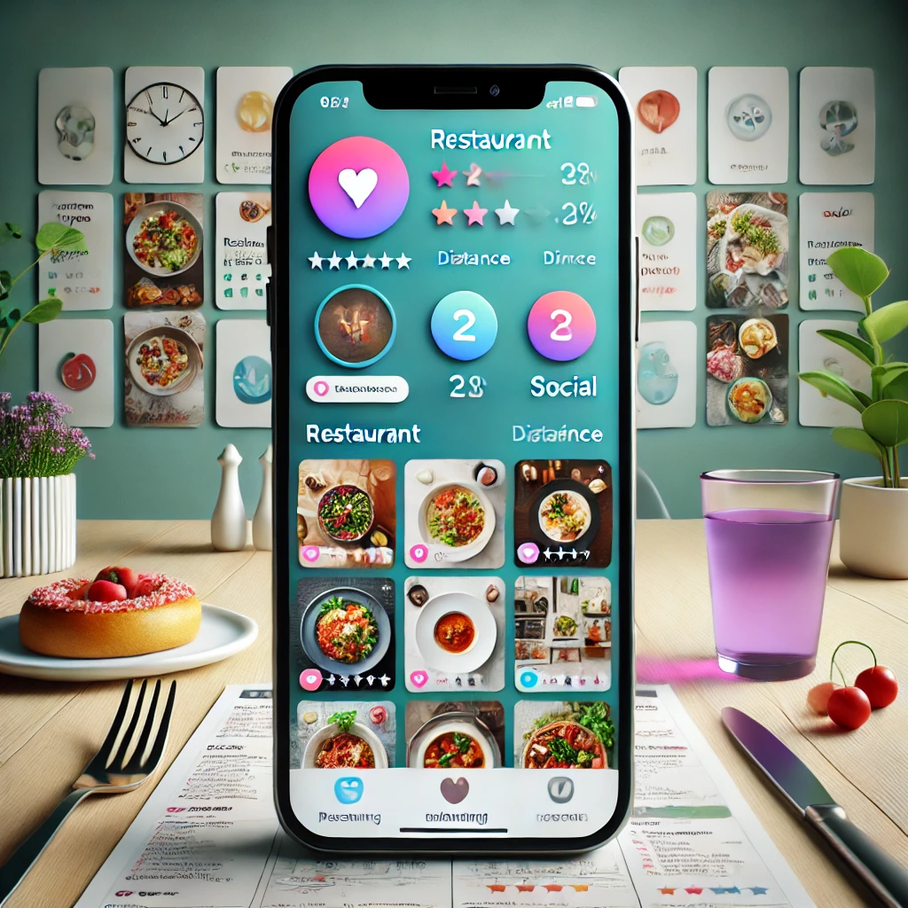

# DS-Project

## 1. Project Overview

This app merges the features of a restaurant recommendation system with those of a social media platform. It allows users to discover restaurants through detailed filtering options while providing a social community for sharing dining experiences, recipes, and tips.

---

## 2. Key Features

### Restaurant Search and Filter Functions:
- Advanced filtering by cuisine type (e.g., Italian, Japanese, Chinese), price range, distance, and ratings.
- Ratings displayed directly on the search page, simplifying the restaurant selection process.
- Recommendations based on proximity and user ratings, helping users make decisions faster.

### Social Media Features:
- A social feed dedicated to sharing dining experiences, food photos, and restaurant reviews.
- Users can upload images of their meals and share detailed reviews of their dining experiences.
- Posts include direct links to restaurant profiles, making it easier to explore dining options from the social feed.
- In addition to restaurant reviews, users can share recipes, cooking techniques, and dietary tips.

### Data-Driven Personalization:
- Personalized recommendations based on user preferences, browsing history, and social activity.
- Users receive dining suggestions tailored to their location, preferred cuisine, and price range.
- Trends and popular restaurants or recipes are highlighted for users based on their engagement with the platform.

---

## 3. User Journey

### Step 1: Browse the Social Feed
Users can explore posts that highlight other users’ dining experiences, recipes, and tips. Posts can be clicked to navigate directly to restaurant profiles or other relevant content.

### Step 2: Discover Restaurants
Users can search for restaurants using filters for cuisine, price range, and distance. The search results are displayed with ratings and additional details, and users can click on a restaurant to learn more.

### Step 3: Engage with Content
Users can like, comment on, and share posts within the community. They can also contribute by sharing their own dining experiences, recipes, and cooking tips.

---

## 4. Future Development Plans
- **Enhanced recommendation algorithms**: Incorporate machine learning to improve restaurant suggestions based on user interactions.
- **User experience improvements**: Further refine the interface to enhance usability and engagement.
- **Integration with delivery platforms**: Allow users to order directly from the app for a seamless dining experience.

---

## 5. Prerequisites
- Basic Python 
- Basic concepts about web development(html, css, javascript)
- Recommandation systems
- For frontend, `flask` is a nice package for us
- For backend, we also need to use `flask` to build the API, communicate with frontend
- Most important, smartly use AI, which may save a lot of time!

---

